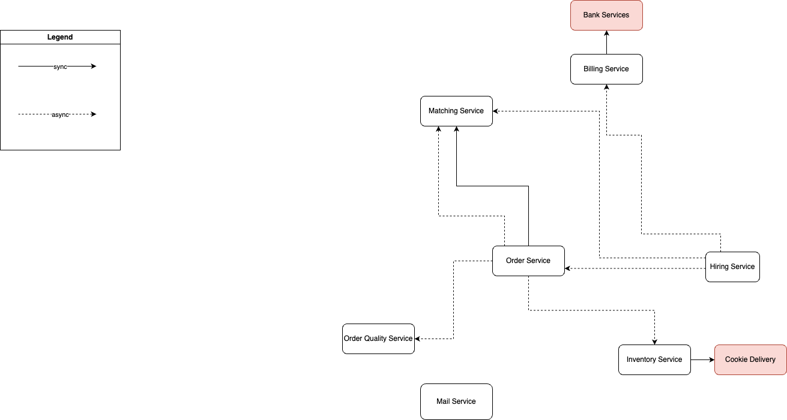

# Описание системы

[Линк на борду миро со всеми диаграммами](https://miro.com/app/board/uXjVMI-SPHE=/?share_link_id=564234195786)

## Поддомены

[Диграмма](https://miro.com/app/embed/uXjVMI-SPHE=/?pres=1&frameId=3458764555101491072&embedId=961281161338)

Выделил 6 доменов, каждый из которых выделяет свою проблему.
- Поддомен ордеринга. Наш кор-поддомен, выделяет нас от других компаний и за счет него зарабатываем деньги. Клиент выставляет заказы, а мы подбираем лучшего воркера под нее. За ее выполнение получаем деньги.
- Найм воркеров. Тоже наш кор-поддомен. Находим топ 3% лучших воркеров из всех кандидатов.
- Инвенторизация - наш вспомогательный поддомен, необходим для выполнения заказов, чтобы у воркеров всегда были необходимые расходники.
- Мотивация менеджеров. Не очень важный вспомогательный контекст для бизнеса. Нужен для мотивации лучшей работы менеджеров.
- Биллинг и аккаунтинг. Обычный дженерик для любой компании контекст, но достаточно важный, для того, чтобы получать деньги компании и платить воркерам.
- Контроль качества. Тоже дженерик домен, нужен, чтобы качество исполнения заказов воркерами было хорошим.

## Контексты и Event Storming

[Контексты](https://miro.com/app/embed/uXjVMI-SPHE=/?pres=1&frameId=3458764555103295110&embedId=586189772687)

Практически совпадает с поддоменами, кроме ордеринга. Здесь мы выделяем, два решения. Один контроль выполнения заказа, и матчинг лучшего воркера под задачу.

[Event Storming](https://miro.com/app/embed/uXjVMI-SPHE=/?pres=1&frameId=3458764555096272425&embedId=468948066349)

Найм воркеров:
Отдельный контекст, необходимый для наема новых воркеров.
Здесь менеджеры создают/изменяют/удаляют тесты, перебирают существующие заявки, ассайнят тесты на кандидатов-воркеров.
Также Accept/Decline-ят кандидатов. И только после чего воркеры попадают в общий пул в контекст матчинга.

Ордеринг:
В нем происходит обработка заказов клиентов, отсюда заказы попадают в контекст матчинга. Контролируется исполнение заказов.
Высокий каплинг со другими контекстами, так как другие контексты опираются на него.

Контекст матчинга:
У созданных заказов должен появиться исполнитель. В данном контексте ассайнится обычный образец на определенный заказ и определяется цена на заказ. Высокий каплинг с контекстом ордеринга.

Контекст инветоринга:
Когда заказы переходят в активный статус, работники склада должны собрать расходники под определенный заказ.
В данном контексте происходит сборка расходников под заказ, также в этом контексте должны обратиться к внешнему сервису доставки печенья.

Контекст биллинга и аккаунтинга:
Данный контекст контроллирует выплаты работникам и списания клиентов.
За каждый заказ перешедший в состояние активный, мы назначаем инвойс клиенту, которую списываем в конце биллинг цикла клиентов(неделя).
Каждый месяц мы назначаем инвойс воркерам исходя из их истории выполненных/зафейленных заказов. 
После того как инвойс создан обращается к стороннему сервису банка для физической выплаты.
Также в данном контексте менеджеры могут назначить награды воркерам.

Контекст ставок:
В данном контексте менеджеры могут создать ставки на заказ и закрыть их.

Контекст качества заказов:
Вся история заказов попадает в этот контекст для того, чтобы менеджеры могли исследовать качество исполнения любого заказа.

## Модель данных

[Диграмма](https://miro.com/app/embed/uXjVMI-SPHE=/?pres=1&frameId=3458764555110218648&embedId=887821311179)

## Характеристики

Найм воркеров: Availability, Scalability, Reliability, Maintainability (характеристики важны, так как конкуренты могут дудосить нас), Usability (должна быть удобной, иначе потеряем ценного воркера, который заработает нам много денег)
Ордеринг: Availability, Scalability, Reliability, Maintainability, Performance, Consistency, Simplicity, Agility, Deployability (наш самый главный контекст, за счет него зарабатываем деньги, должен быть высоко-надежный, и поддающийся изменениям во внешнем мире)
Контекст матчинга: Availability, Scalability, Modifiability, Maintainability, Performance, Agility, Deployability (сильно связан с контекстом ордеринга, так что аналогично должен быть надежным при этом можем очень часто менять его работу)
Контекст инветоринга: Consistency, Maintainability, Supportability (сервис не должен быть супер надежным, но зато легко восстанавливаться после поломок и его должно быть легко поддерживать)
Контекст биллинга и аккаунтинга: Supportability, Securability, Consistency (работаем с деньгами, так что важно сесурити и консистентность)
Контекст ставок: не особо важный контекст и редко меняется, пусть хотя бы работает. Можно на аутсорс
Контекст качества заказов: Supportability, Readability (тоже можно на аутсорс)

## Схема сервисов

Для более корректной разбиении логики была выбраны микросервисная архитектура.
Изначально рассматривал именно микросервисную архитектуру, так как контексты разбиваются так, что можно избежать распределенные транзакции.

Для аутентификации в системе используется отдельный сервис IAM, хранящий роли и умеющий в SSO.

Сервис Hiring-а:
Имеет Manager-API для CUD над тестами, просмотра истории заявок и просмотра информации о кандидатах, ассайна тестов и Accept/Decline кандидатов.
Public-API для приема заявок и прохождения заассайненных тестов.

После Accept кандидата помещает в очередь бизнес-эвент, что появился новый воркер. В IAM создается новая учетка (сохраняются данные об учетке, шлются креды и тд) в сервис Matching-а читает информацию и создает и по ней создает характеристику. Сервис биллинга создает платежный аккаунт.

Сервис Ordering-а:
В нем клиенты добавляют/отменяют заказы, и он контролирует их выполнение, паблишит изменение статусов каждого заказа.

Сервис Matching:
Читает события сервиса Order-ов и хранит ее (может не полностью). Также хранит информацию о характеристиках воркеров. На основе всей этой информации производит матчинг между заказами и воркерами. Паблишит события на ассайн, которые читает ордер сервис для обновления статуса заказа.

Сервис Inventory:
Читает заказы и контроллирует сборку расходников под заказ. Ходит синхронно в сторонний сервис за заказом печенек.

Сервис Billing:
Хранит платежный аккаунт воркеров и клиентов. Читает историю изменения заказов для создания операций, по которым будет создаваться инвойсы и производиться выплаты. Производит выплаты по окончанию биллинг циклов.
Также имеет Manager-API для выплаты авардов от менеджеров для воркеров.

Сервис Bet:
Позволяет менеджерам делать ставки на активные заказы. Синхронно ходит сервис ордеров для получения активных заказов и в биллинг для выплат/списаний менеджерам.

Сервис качества заказов:
Читает события из сервиса заказов и хранит их историю для менеджеров. Ходит в сервис матчинга, например для изменения характеристик воркеров.

Mail сервис:
Обертка на SMTP, ходят все сервисы, которым надо делать нотификации.
