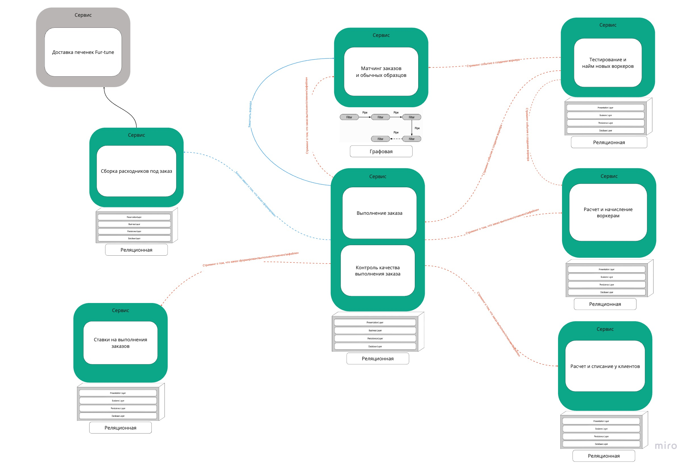

# ADR-001: Выбор архитектурного стиля для Make cats free again

[Линк на борду миро со всеми диаграммами](https://miro.com/app/board/uXjVMES1DKY=/?share_link_id=667747490742)

Рекомендую смотреть здесь, тк некоторые диаграммы может быть не очень хорошо видно.

Старался сразу написать в стиле ADR, чтобы потом не копировать из одного места в другое одну и ту же информацию.

## Стейкхолдерами и их консерны

Стейкхолдеры.
- Топ-менеджеры определяют развитие бизнеса, так что у них высокая заинтересованность и влияние.
- Финотдел очень важен для бизнеса и напрямую влияет на бизнес.
- Менеджеры вовлечены в многие бизнес-процессы.
- У админов может быть на один проект больше/меньше, поэтому они невысокая заинтересованность в проекте
- К разработчикам и клиентам мы будет прислушиваться, но не факт, что исполнять все хотелки
- Юристы :D

Диаграмма влияния/заинтересованности стейкхолдеров

- Cкоринг работников очень важен и мы захотим продавать -> high model complexity, а также укажем, что это big-bet subdomain.
- Релизный цикл для скоринга - неделя, значит у этого контекста высокий evolvability и deployability.
- Хотелка финотдела про потерю информации -> consistency.
- Менеджеры прогнозируют высокую нагрузку -> scalability, performance, availability для контекста выполнения заказов

Диаграммы консернов

В диаграмме поддоменов изменение потерпит только найм воркеров, так как бизнес делает на него ставку.

## Поддомены и контексты

Диаграмма поддоменов

- Из низкого TTM делаем вывод, что для всей системы важны характеристики agility, deployability, testability.
- Для найма воркеров из требований и консернов нам важны: evolvability, high model complexity, reliability, evolvability, performance, scalability, elasticity
- Для выполнения заказа из консернов нам важны: availability, scalability
- Так как Матчинга заказов и обычных образцов и Сборке расходников напрямую зависят от выполнения заказа (заказы стримятся) то туда добавим scalability.
- Из консернов финотдела добавим consistency в контексты Расчет и списание у клиентов и Расчет и начисление воркерам
- Также добавим modifiability для списаний клиентов так как там будут добавляться новые способы оплаты 

[Контексты](https://miro.com/app/embed/uXjVMES1DKY=/?pres=1&frameId=3458764555635332359&embedId=118315567944)

## Event-Storming и Models

Консерны напрямую не влияют на ES и модели, приложу диаграммы.

[Event-Storming](https://miro.com/app/embed/uXjVMES1DKY=/?pres=1&frameId=3458764555635332353&embedId=899303958665)

[Models](https://miro.com/app/embed/uXjVMES1DKY=/?pres=1&frameId=3458764555635332364&embedId=281280710863)

## Архитектурное решение

Нам важны agility, deployability, testability. Из этого делаем вывод, что подойдет только:
service-based и microservices архитектуры. 

Был выбран microservices архитектуры из двух вышеперечисленных, так как помимо общих характеристик
для некоторых контекстов нам важны такие характеристики как scalability, elasticity, evolvability и reliability,
а у microserviced стиля эти характеристики выше, чем у service-based. 

### Сервисы

[Диаграмма сервисов(по линку более HD)](https://miro.com/app/embed/uXjVMES1DKY=/?pres=1&frameId=3458764555643666003&embedId=440117674098)

- Сервис аккаунтинга под контекст списания у клиентов. Выделен в отдельный сервис, так как
есть общие характеристики свойственны только этим контекстам (consistency, modifiablity). Внутри может использовать, как layered-архитектуру. Подойдет реляционная изолированная база.
- Сервис аккаунтинга под контекст начисления воркерам. Выделен в отдельный сервис, так как
    есть общие характеристики свойственны только этим контекстам (consistency). Внутри может использовать, как layered-архитектуру. Подойдет реляционная изолированная база.
- Доставка Fur-tune печенья - стороннее generic решение
- Тестирование и найм новых воркеров: это кор-поддомен с кучей характеристик свойственных только данному контексту. + Отличается релизный цикл. Отдельный сервис. Внутри выглядит как layered-монолит. Подойдет, как реляционная база, так и документориентированная база (так как может быть неоднородной структура тестов, или характеристик воркера), но чтобы не выбиваться из стека возьмем реляционную.
- Сборка расходников выделен в отдельный поддомен инвенторизации воркеров. Не хочется смешивать его с другими поддоменами, поэтому вынесем в отдельный сервис. Внутри выглядит как layered-монолит. Так как структура сборки заказа строгая и однородная подойдет реляционная база.
- Матчинг заказов и обычных образцов - кор-поддомен с характеристиками свойственным только этому контексту. Отдельный сервис. Так как состоит из многих шагов, которые хотим часто менять внутри использует pipeline-архитектуру. Так как может быть много различных неявных связей-агрегаций возьмем графовую базу данных.
- Контекст ставки вынесены в сервис, так как менеджеры хотят изолировать знание о нем. + Находится в отдельном поддомене и решает отдельную проблему мотивации менеджеров. Использует layered-архитектуру. Структура ставки строгая и однородная - возьмем реляционную.
- По остаточному принципу объединим контексты выполнения заказа и контроля качества в отдельный сервис. Внутри выглядит как layered-монолит. Они находятся в одном и том же поддомене + работают с одним и тем же агрегатом: заказ. Структура заказа строгая и однородная - возьмем реляционную.

### Коммуникации
Для общения с сервисом Fur-tune используем синхронный request-response стиль. Так как это сторонний сервис с простой логикой.

Для ассайна воркера аналогично request-response стиль.

Для всех остальных коммуникаций используем асинхронный event-driven стиль, так как нам не сильно важен незамедлительный респонс,
а также события с изменением статуса заказа должен стримиться в разные сервисы, а мы не хотим плодить распределенные транзакции.

Аналогично со стримингом создания воркера.

Матчинг слушает стрим изменений заказов для корректировки работы алгоритма.
Так как алгоритм может быть сложным и долго работать, бизнес эвент о том, что воркер подобран, отсылается ассинхронно.

## Фитнес-функции для валидации системы

Мне ближе go-стек, так что используем его:
- для проверки тестабилити используем code-coverage, дабы легко его мерить
- для agility набор линтеров + есть аналог ArchUnit (go-arch), никогда не использовал, но можно попробовать
- для валидации cohesion-а/coupling-а можно использовать телеметрию+jaeger. Можно построить диаграмму вызовов.  
