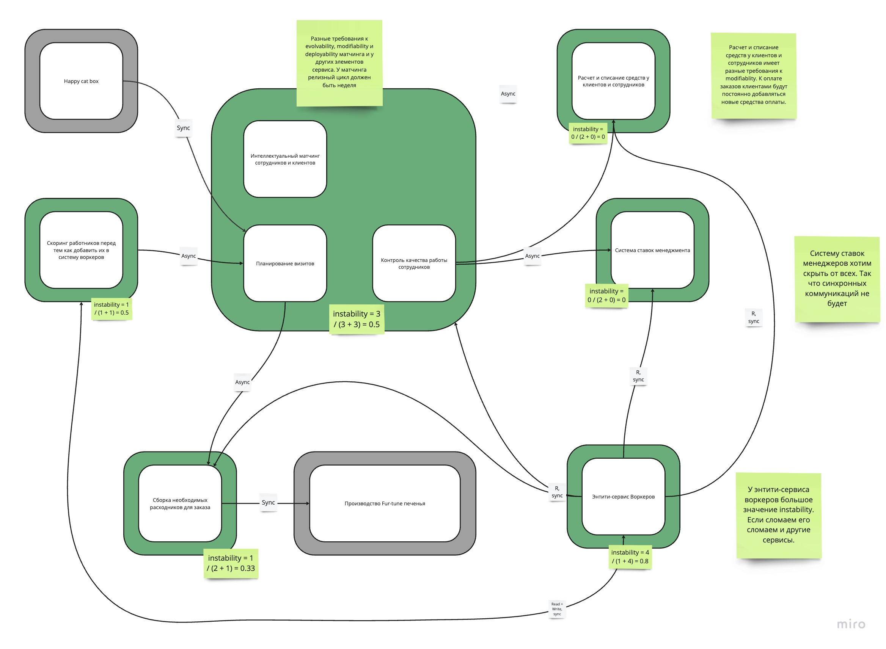
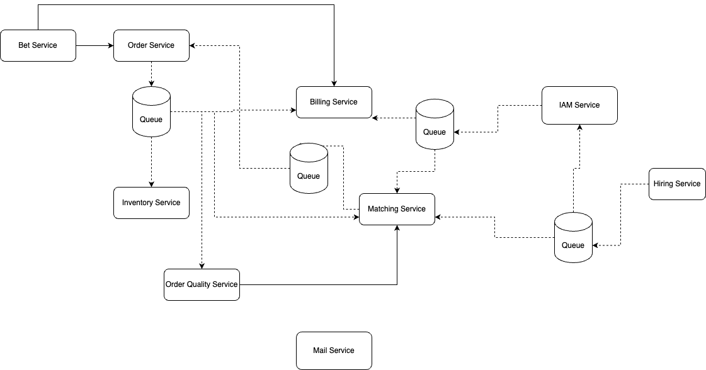
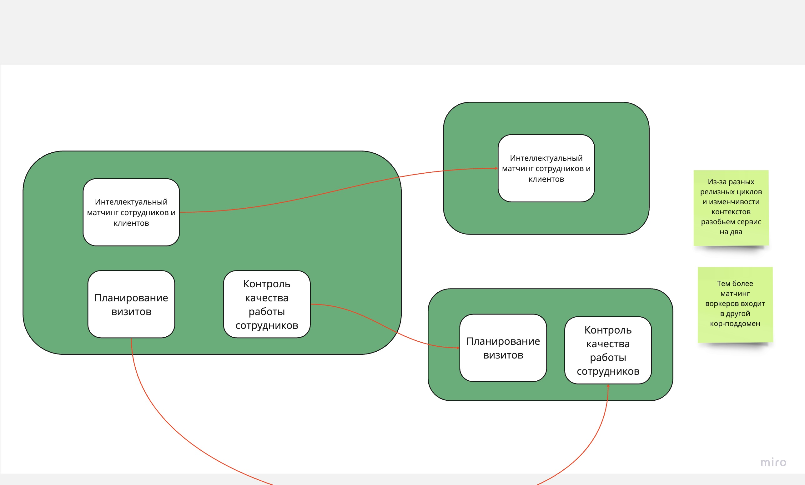
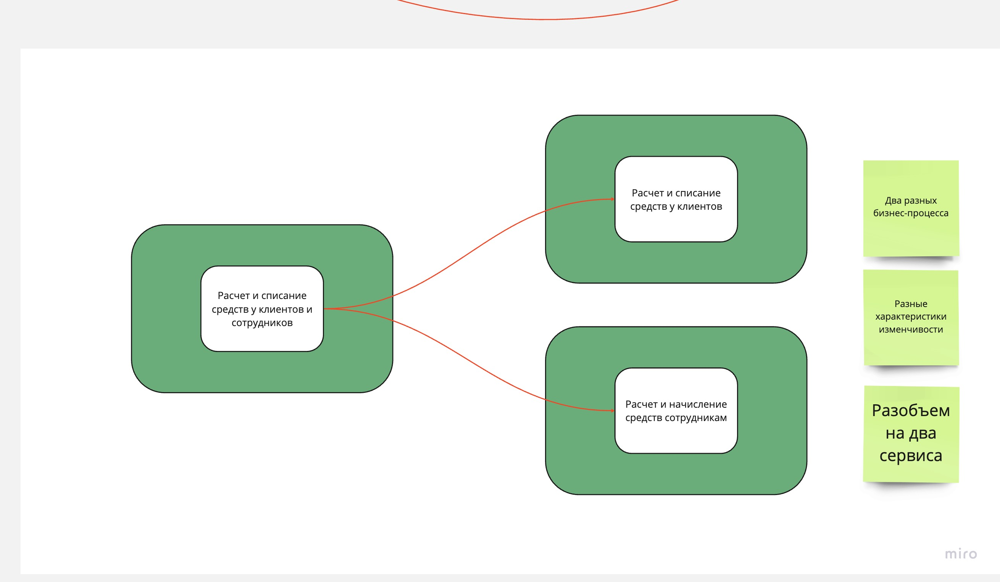
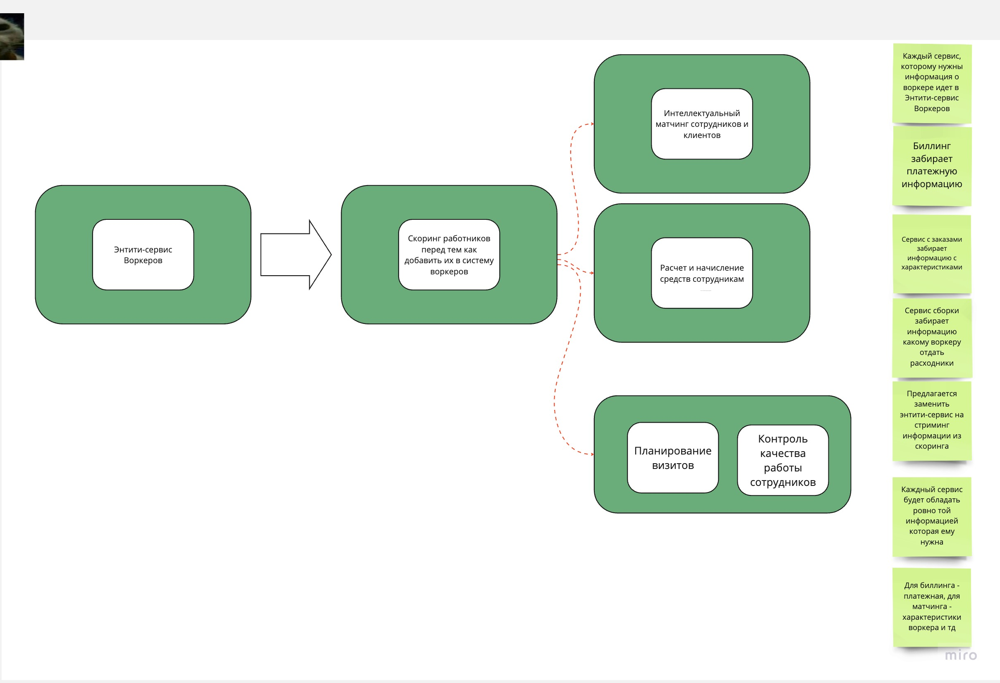
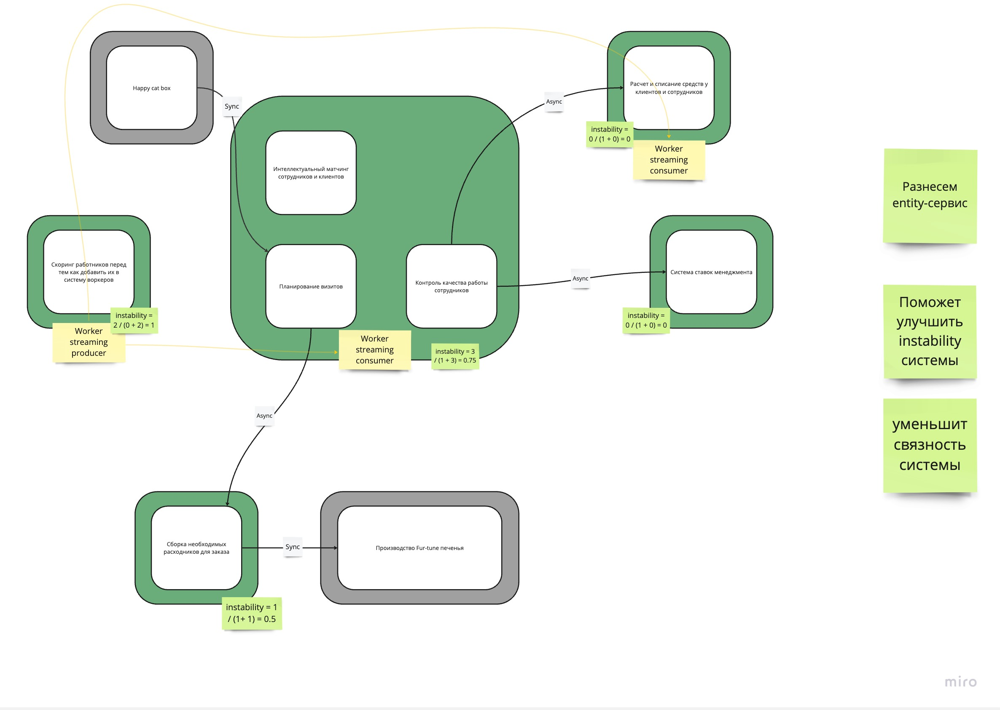
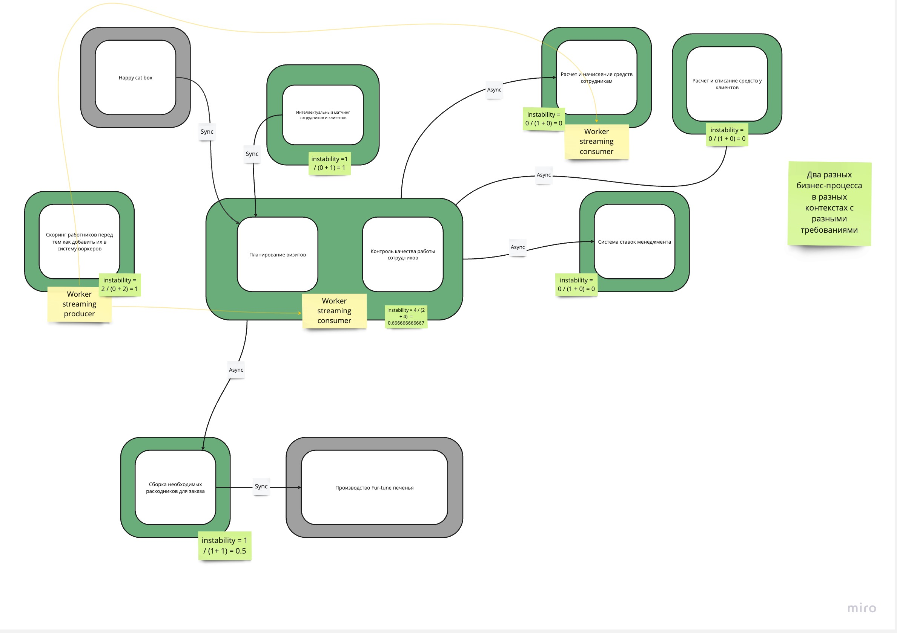

# Неделя 4

[Линк на борду миро со всеми диаграммами](https://miro.com/app/board/uXjVMES1DKY=/?share_link_id=549504476777)

Для рефакторинга взял схему из урока  

Из нулевой домашки тоже есть схема сервисов, но там придется рефакторить сильно меньше. 

В текущей системе необходимо исправить 3 момента:

Вынести матчинг:

Разнести аккаунтинг

Разнести энтити сервис

Будем отталкиваться от стратегии когда нет ресурсов, а опыт есть:

Шаг 1:
Разнесем entity-сервис

Шаг 2:
Вынесем матчинг в отдельный сервис:

Шаг 3:
Разнесем аккаунтинг на 2:
